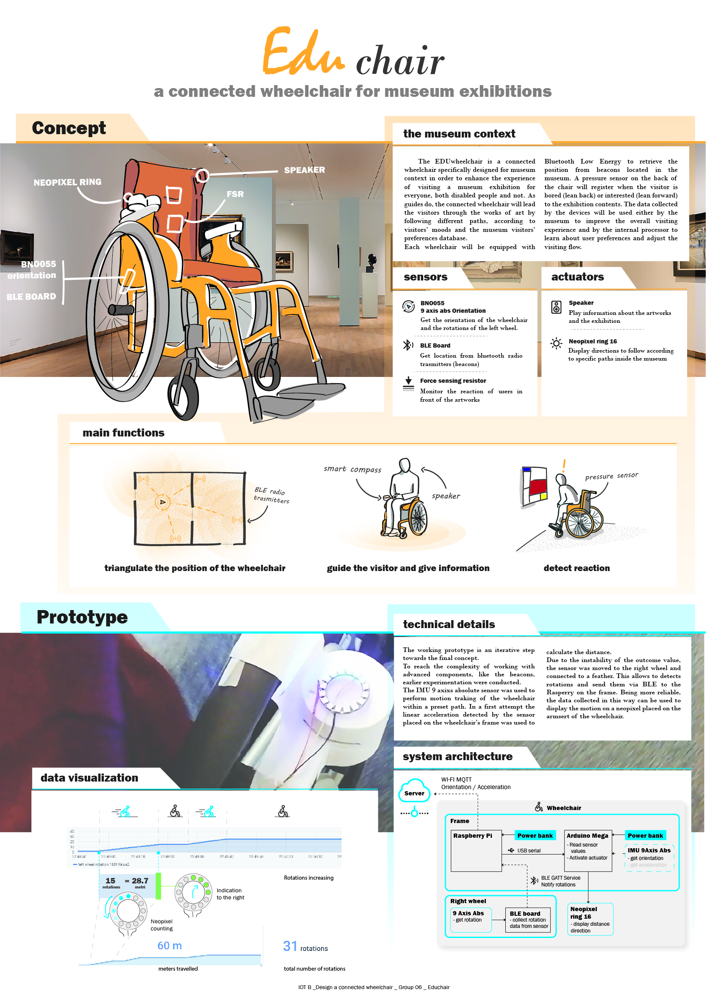

# The EDU Wheelchair:
### a connected wheelchair for museum exhibition

by Dario Sapienza and Samira Miccolis

# concept description:
The EDU-wheelchair is a connected wheelchair specifically designed for museum context in order to enhance the experience of visiting a museum exhibition for everyone, both disabled people and not. As guides do, the connected wheelchair will lead the visitors through the works of art by following different paths, according to visitors’ moods and the museum visitors’ preferences database.
Each wheelchair will be equipped with Bluetooth Low Energy to retrieve the position from beacons located in the museum. A pressure sensor on the back of the chair will register when the visitor is bored (lean back) or interested (lean forward) in the exhibition contents. The data collected by the devices will be used either by the museum to improve the overall visiting experience and by the internal processor to learn about user preferences and adjust the visiting flow.

## Main functions of the concept

* Triangulate the position of the wheelchair through BLE connection (beacons) installed inside the museum.

 

* Guide the visitors with a smart compass and give information via audio.

 

* Detect the reaction of the users in front of an artwork by monitoring the posture on the wheelchair.

 

## List of sensors for the concept:
 __**Sensors**__
* __**BNO055 9axis Abs**__ - Gets the orientation of the wheelchair and the rotations of the left wheel.
* __**Force sensing resistor (FSR)**__ - Monitors the reaction of user in front of the artwork by sensing the force applied on the back of the wheelchair.

__**Actuators**__
* __**Speakers**__ - Plays an audio tour according to the position of the user in the exhibition.
* __**Neopixel ring x 16**__ - Indicates the distance traveled by the users and shows the direction that they need to follow.

__**Other**__
* __**Feather BLE board**__ - Receives the bluetooth low frequency signals from the beacons placed in the museum.

---

## Prototype description

The working prototype is an iterative step towards the final concept.
Several experimentations were conducted as preparation to work with more complex components such as beacons. The BNO055 9 axis absolute sensor has been used to perform a rough motion traking of the wheelchair within a preset path.
The first attempt included using the 9 axis absolute sensor, placed on the frame of the wheelchair, to detect the linear acceleration of the wheelchair while moving. This data, together with the length of the movement allows to calculate the distance travelled. This could have been used in the context of a pre-set path to set a threeshold as trigger for the actuators.
However, the instability of the acceleration values made the outcome calculation unrealiable.
Therefore, the sensor was connected to a Feather BLE board and moved to the right wheel. The presence of the feather allows the use of the sensor to detects rotations without the cables constraints and to send the data via BLE to the Rasperry. Being more reliable, this data can be used to display the motion on a neopixel ring placed on the armrest of the wheelchair.

## Implemented components

The main design includes a Raspberry Pi 3, an Arduino Mega 2560 on the wheelchair frame and a Feather BLE board (bluetooth enabled) on the right wheel.

The Arduino Mega is the micro-controller of the platform. Fixed on the main frame of the wheelchair,
it gets data from the Raspberry Pi via serial connection and triggers a Neopixel ring x 16.

The Raspberry Pi, attached to the main frame, is used as microprocessor. In this project the functions of the Raspberry are:

* interact with the Feather BLE board through bluetooth connection and subscribes to the GATT caracteristic of rotation;
* interact with the Arduino Mega via USB to transmit commands;
* interact with the Internet to transmit commands and receive data;
* store data locally in files;

These is described in the following diagram:


## Components and wiring

On the frame:

* 1 Raspberry Pi 3B;
* 1 SD card;
* 1 Arduino Mega;
* 1 Large power bank;
* 1 USB cable A/micro (Powerbank to Raspberry Pi);
* 1 USB cable A/B (Raspberry Pi to Arduino Mega).

On the armrest:

* 1 Neopixel ring x 16;

The elements are wired as shown in the picture below and the neopixel is secured on armrest


On the wheel:

* 1 Feather (Bluetooth enabled);
* 1 small power bank;
* 1 small breadboard;
* 1 USB cable A/B (power bank to Arduino Uno).

The elements are wired as shown in the picture below; the breaboard and the powerbank are secured on the wheel spokes.


The picture below shows how the components have been implemented on the different parts of the wheelchair


## Main Components setup

#### Working with git
This project is based on the contents and dependencies provided with the GitHub repository of the Wheelchair Design Platform:
<a href="https://github.com/datacentricdesign/wheelchair-design-platform" target="_blank">https://github.com/datacentricdesign/wheelchair-design-platform</a>

In this case a fork of the repository has been used to experiment with changes without affecting the original project. A description of how to fork a repository can be found here: <a href="https://help.github.com/articles/fork-a-repo/" target="_blank">(GitHub Help)</a>

Inside the forked repository a new project have been created and cloned to have a local copy on our computers.

#### Suggested text editor
The text editor (IDE) used for the project was <a href="https://atom.io/" target="_blank">(Atom)</a>.
Use git commands to open to open the codes in your text editor and to manage it while working.

#### Cloud server
the project is based on a cloud server, where the data collected are uploaded and stored. For this purpose the data centric design Hub prototype from Tu Delft has been used.

1. creates an account, by signing up to this link [DCD hub](https://dwd.tudelft.nl/auth/signin?login_challenge=c84123b9885e483daef1bb1d8c2f8186) with your e-mail address, name and password.
2. click on my thing button to create your THING and give it name. This will generate a thing id and an access token for your thing.
3. Copy and save this information, as they will enble the communication between the hub and the raspberry.

#### Raspberry Pi

1. set up the laptop-raspberry direct connection by extracting the SD card and creating 2 text files at the root of the boot:
 * ssh (without any extension) to enable a secure shell protocol
 * wpa_supplicant.conf containing the following content

    ```bash
    country=NL
    update_config=1
    ctrl_interface=/var/run/wpa_supplicant

    network={
    ssid="YOUR_NETWORK_SSID"
    psk="YOUR_NETORK_PASSWORD"
             }
    ```
 to connect the raspberry to the network

3. it would be needed an IP scanner to retrieve the IP address of your rasperry  

4. after inserting back the SD card and powering the raspberry, open a text editor (for instance, Powershell in case of windows workers) and type the following line, to access your raspberry

      ```bash
      ssh pi@ "type here your raspberry IPaddress"
      ```
4. if working with github repository set up git and clone your repository using:

      ```bash
      sudo apt-get install git
      git clone "link of your repository on github"
      ```
5. use the command

      ```bash
      cd "name of your folder"
      ```
to navigate through the folders and at the root of your project folder, create a .env file using the command

      ```bash
      nano .env
      ```

      paste the following lines

      ```bash
      THING_ID = paste here the copied thing ID
      THING_TOKEN = paste here the copied thing token
      SERIAL=/dev/ttyAM0
      ```

5. the project will use the requirements listed in the [requirements file](requirements.txt) containing both dependences for the library written for the Data-Centric Design Hub and dependences for the communication protocol MQTT, used to talk to the hub. Install them, by using pip (a tool that manages packages, used to update any Python library)

      ```bash       
      python3 -m pip install -r requirements.txt --user
      ```

6. type in the following commands to install the bluetooth dependencies which will allow to subscribe to the GATT (Generic ATTribute Profile) service from the Raspberry Pi and upload data collected to the Hub.

      ```bash
      sudo apt-get install bluez libbluetooth-dev

      sudo pip3 install git+https://github.com/peplin/pygatt

      sudo pip3 install "pygatt[GATTTOOL]"

      sudo pip3 install bluepy

      sudo pip3 install pexpect
      ```

#### Arduino Mega
1. connect the Arduino Mega to the computer via serial

2. open the Arduino IDE

3. install the following libraries:
```cpp
#include <Wire.h>
#include <Adafruit_Sensor.h>
#include <Adafruit_BNO055.h>
#include <utility/imumaths.h>
#include <Adafruit_NeoPixel.h>
```
4. in the Arduino IDE, go in the top menu 'Tools > Boards', and select 'Arduino/Genuino Mega or Mega 2560'

5. check that the right serial port is selected in 'Tools > Port'

6. flash the Arduino code <a href="\wheelchair\final code\led_straight_01" target="_blank">(led_straight_01)</a> to the Arduino Mega board.

#### Feather 32u4 Bluefruit LE
1. connect the Feather 32u4 to the computer via serial

1. setup the board as shown <a href="https://github.com/ctsai-1/wheelchair-design-platform/blob/master/docs/resources/feather.md" target="_blank">(here)</a>

1. install the following library (Bluefruit nRF51), which you can do in Sketch -> Include Library -> Manage Libraries

2. for the project we will also need the following libraries:
```cpp
#include <Arduino.h>
#include <SPI.h>
#include <Wire.h>
#include <Adafruit_Sensor.h>
#include <Adafruit_BNO055.h>
#include <utility/imumaths.h>
#include "Adafruit_BLE.h"
#include "Adafruit_BluefruitLE_SPI.h"
#include "Adafruit_BluefruitLE_UART.h"
#include "BluefruitConfig.h"
```
4. Flash the code <a href="\wheelchair\final code\bno055_gatt_orientation_rotation" target="_blank">(bno055_gatt_orientation_rotation)</a> to the Feather 32u4.

4. Go back to Python text editor and type the command 'blescan' to scan the bluetooth devices available.

 ```cpp
sudo blescan
```
5. From the list of the bluetooth available check your device name, Copy the MAC address and paste in your .env file as a new environment variable 'BLUETOOTH_DEVICE_MAC', for example:

 ```bash
BLUETOOTH_DEVICE_MAC=fb:48:5b:84:36:4a
```

## Working prototype

Once all the different components are set up, we can run the python code <a href="wheelchair\final code\nudge_neopixel_rotation_0forcompass" target="_blank">(nudge_neopixel_rotation_0forcompass)</a>.

In this code we are:

1. defining the GATT characteristic to which subscribe and creating a new property in the dcdhub

```bash
    GATT_CHARACTERISTIC_ROTATION = "02118733-4455-6677-8899-AABBCCDDEEFF"
    ADDRESS_TYPE = pygatt.BLEAddressType.random

    def find_or_create(property_name, property):
        """Search a property by name, create it if not found, then return it."""
        if my_thing.find_property_by_name(property_name) is None:
            my_thing.create_property(name=property_name,
                                     property=property)
        return my_thing.find_property_by_name(property_name)
```
2. receiving the data from the BNO055 9axis Abs which are sent as bites string and decoding them to get a float number to handle

```bash
def handle_rotation_data(handle, value_bytes):
    """
    handle -- integer, characteristic read handle the data was received on
    value_bytes -- bytearray, the data returned in the notification
    """
    print("Received data: %s (handle %d)" % (str(value_bytes), handle))
    #rotation_values = [0, 0]
    rotation_values = [float(x) for x in value_bytes.decode('utf-8').split(",")]
    print("float data collected")
    find_or_create("Left Wheel Rotation",
                   PropertyType.TWO_DIMENSIONS).update_values(rotation_values)
```
3. turning float values into integer

```bash
num_rot = math.floor(rotation_values[0])
```
4. sending command '1' each rotation trough serial to the Arduino Mega (when the previous rotation value is equal to the actual rotation value minus one)

```bash
if ((num_rot % 10) != 0 and prev_val == (num_rot - 1)):
      print("1 ON ")
      ser.write('1'.encode())
```
5. sending the command '0' to the Arduino Mega every 10 rotation (when the total number of rotations divided by 10 has 0 as reminder)

```bash
if ((num_rot % 10) == 0 and (num_rot != 0) and (prev_val != 0)):
      print("0000000 sent")

      ser.write('0'.encode())
```

When the Arduino Mega board reads the command '1' triggers a single led of the Neopixel Ring, one led per rotation.

When receiving the command '0' the Arduino Mega triggers the Neopixel ring to light up 3 green leds on the right part of the Nepixel led. This behaviour communicates to the user in which direction to turn.

The behaviour of the prototype can be seen in the following video [IOT video-group 6](https://vimeo.com/user94548035/review/330320122/44a0cd5891).

The data collected from the BNO055 9 axis sensor are pushed to the DCD hub and can be visualized in Grafana as follows:


You can access Grafana <a href="https://dwd.tudelft.nl/grafana/login" target="_blank">(here)</a>

#### Video
[IOT video-group 6](https://vimeo.com/user94548035/review/330320122/44a0cd5891)

## Poster Educhair



## Contact and Existing projects

* [The hiking wheelchair](https://github.com/cprecioso/wheelchair-design-platform)
* [The EDU wheelchair](https://github.com/ctsai-1/wheelchair-design-platform)
* [Weelchair tracking for basketball players](https://github.com/FabianIDE/wheelchair-design-platform)
* [Disco Wheelchair](https://github.com/MatthijsBrem/wheelchair-design-platform)
* [Wheelchair Madness 2222](https://github.com/pherkan/wheelchair-design-platform/tree/master/wheelchair)
* [Who is sitting?](https://github.com/Rosanfoppen/wheelchair-design-platform/tree/master/wheelchair)
* [Magic Wheelchair](https://github.com/Yuciena/wheelchair-design-platform)
* [Yoga Wheelchair](https://github.com/artgomad/wheelchair-design-platform)
